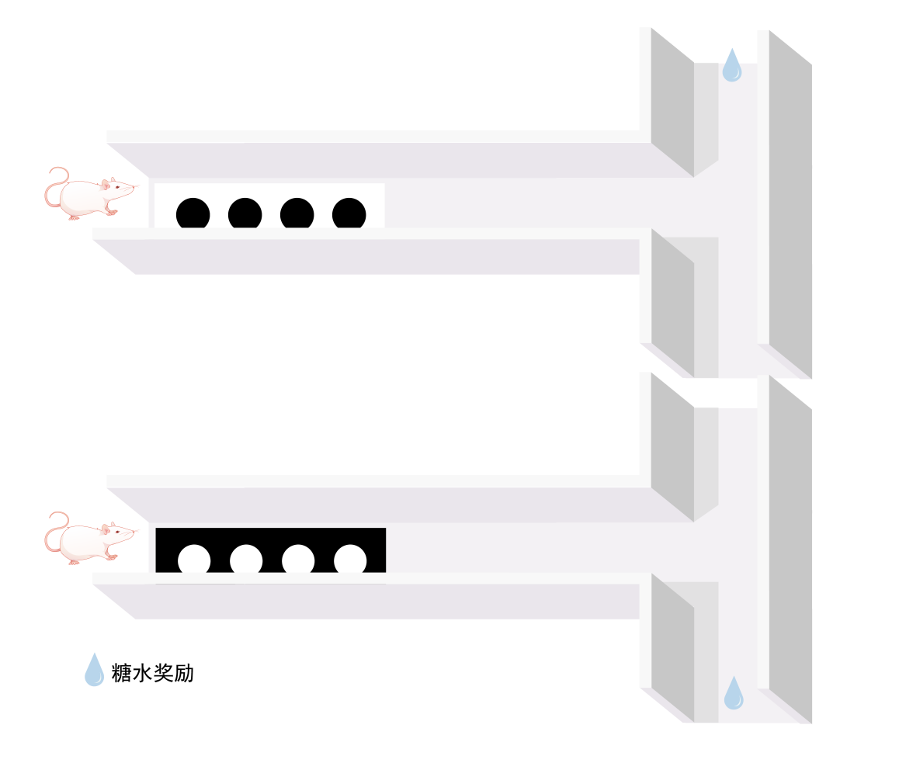
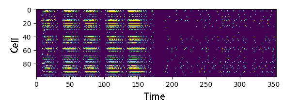

# 系统与计算神经科学作业

本项目是基于RSNN的模拟小鼠决策任务的程序。程序模拟了小鼠的感知、工作记忆和决策实验。实验设定小鼠在丁字形通道内，先经过带有提示信息的通道，再经过没有信息的通道，最终路口处决定左转或右转。通过奖励信息对小鼠行为进行训练。本程序通过计算建模对此实验进行模拟。搭建RSNN循环脉冲神经网络模拟小鼠大脑活动，通过监督训练模拟小鼠的学习行为，最终使得网络具有感知、工作记忆和决策能力。

详细报告内容见
[小组项目报告](report.pdf)


## Requirements

- Python >=3.6
- Pytorch =1.12.1
- braincog =0.2.7.15
- matplotlib =3.6.2

## Setting things up

## Using Pip
To install the most recent stable release from the GitHub repository

```
pip install git+https://github.com/jdy18/Crossing.git
```

## Getting started

To run a script of the RSNN with trainging method of e-prop, issue

```
python main.py
```
## Environment

<p align="middle">

</p>

## Result

<p align="middle">

</p>

All simulations run on Ubuntu 16.04 LTS with Intel(R) Xeon(R) CPU E5-2687W v3 @ 3.10GHz, 128Gb RAM @ 2133MHz, and two GeForce GTX TITAN X (GM200) GPUs. Python 3.6 is used in all cases. Clock time was recorded for each simulation run. 


## Contributors

- 马国庆 (学号：202218020428003 [email](zgmaguoqing@163.com) )
- 张予涵 (学号：202218014628014 [email](3289360744@qq.com))
- 江德扬 (学号：202218020428001 [email](jiangdeyang2022@ia.ac.cn))
- 魏雅轩 (学号：202218020415011 [email](weiyaxuan0714@163.com))
- 林楚儿 (学号：202218020428002 [email](linchuer22@mails.ucas.ac.cn)）
